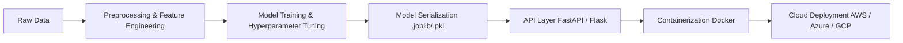
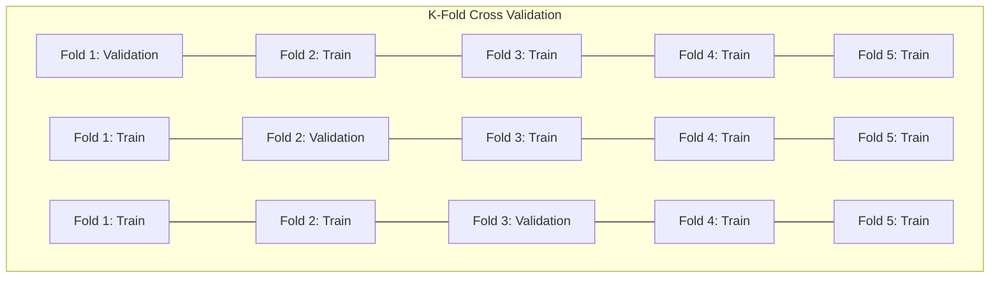
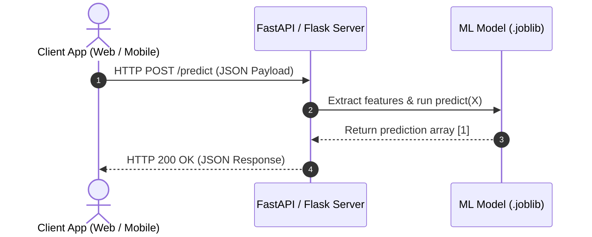
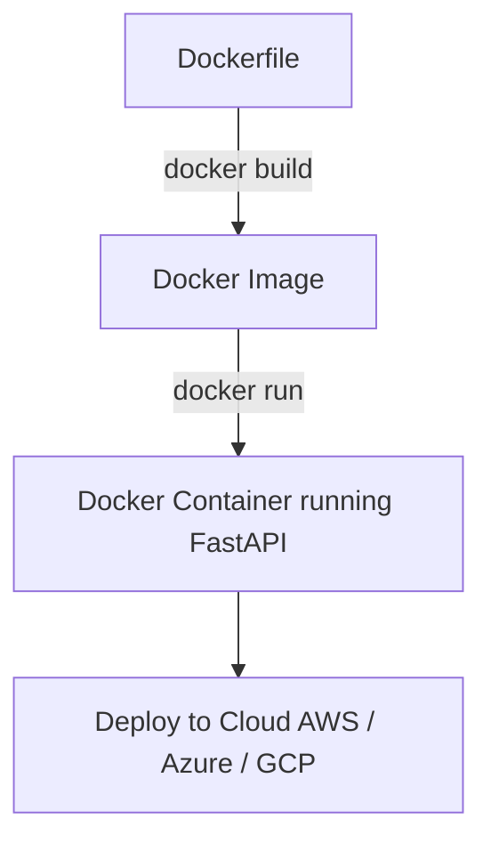
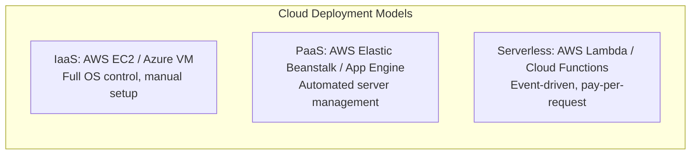
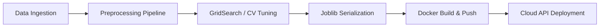

# 📙 Topic 03: ML – Model Deployment & Fine-Tuning

Model Deployment and Fine-Tuning represent the final stages of the Machine Learning lifecycle. Training a high-performing model inside a Jupyter Notebook is only the first step; transitioning that model into a production-ready, scalable environment allows business applications and end-users to consume real-time predictions.



---

## 🛠️ Section 1: Model Fine-Tuning & Hyperparameter Optimization

### 1. Parameters vs. Hyperparameters

* **Parameters**: Internal model variables learned directly from training data during optimization (e.g., weights $w$ and biases $b$ in Linear Regression or Neural Networks).
* **Hyperparameters**: External configurations set by the Machine Learning Engineer prior to training to control model behavior and capacity (e.g., learning rate, `n_estimators`, `max_depth`, regularization strength $\alpha$).

---

### 2. Hyperparameter Search Strategies

```mermaid
grid
```

| Strategy | Description | Pros | Cons |
| :--- | :--- | :--- | :--- |
| **GridSearchCV** | Exhaustive search over a manually specified grid of hyperparameter values. Evaluates every permutation. | Guaranteed to find the optimal combination within the defined grid. | Computationally expensive and slow for large hyperparameter spaces. |
| **RandomizedSearchCV** | Randomly samples a fixed number of parameter combinations (`n_iter`) from specified probability distributions. | Significantly faster; scales well to large parameter search spaces. | May miss the absolute global optimum, but finds a near-optimal solution quickly. |

---

### 3. K-Fold Cross-Validation (CV)

To prevent data leakage and overfitting to a single train-test split, **$K$-Fold Cross-Validation** partitions the dataset into $K$ equal-sized subsets (folds). The model is trained on $K-1$ folds and validated on the remaining fold, repeating this process $K$ times.



The final performance metric is calculated as the mean score across all $K$ iterations, providing a realistic estimate of out-of-sample performance.

---

### 💻 Hyperparameter Tuning Code Example

```python
import numpy as np
from sklearn.datasets import make_classification
from sklearn.model_selection import train_test_split, GridSearchCV, RandomizedSearchCV, KFold
from sklearn.ensemble import RandomForestClassifier
from scipy.stats import randint

# Generate synthetic dataset
X, y = make_classification(n_samples=1000, n_features=20, n_informative=15, random_state=42)
X_train, X_test, y_train, y_test = train_test_split(X, y, test_size=0.2, random_state=42)

# Base Model
rf_base = RandomForestClassifier(random_state=42)

# 1. GridSearchCV Example
param_grid = {
    'n_estimators': [50, 100, 150],
    'max_depth': [10, 20, None],
    'min_samples_split': [2, 5]
}

grid_search = GridSearchCV(estimator=rf_base, param_grid=param_grid, cv=5, scoring='accuracy', n_jobs=-1)
grid_search.fit(X_train, y_train)

print(f"GridSearchCV Best Parameters: {grid_search.best_params_}")
print(f"GridSearchCV Best CV Score: {grid_search.best_score_:.4f}")

# 2. RandomizedSearchCV Example
param_distributions = {
    'n_estimators': randint(50, 200),
    'max_depth': [5, 10, 15, 20, None],
    'min_samples_split': randint(2, 11)
}

random_search = RandomizedSearchCV(estimator=rf_base, param_distributions=param_distributions, 
                                   n_iter=10, cv=5, scoring='accuracy', random_state=42, n_jobs=-1)
random_search.fit(X_train, y_train)

print(f"\nRandomizedSearchCV Best Parameters: {random_search.best_params_}")
print(f"RandomizedSearchCV Best CV Score: {random_search.best_score_:.4f}")
```

---

## 📦 Section 2: Model Serialization (Saving & Loading Models)

Once hyperparameter tuning and cross-validation yield an optimized model, the in-memory Python object (stored in RAM) must be saved to disk as a persistent binary file. This process is called **Serialization** (or Pickling).

* **`pickle`**: Built-in Python module for serializing general objects.
* **`joblib`**: Optimized library for objects containing large NumPy arrays (preferred for ensemble models like Random Forest).

### 💻 Serialization Code Example

```python
import joblib

# Assume best_model is our trained model from GridSearchCV
best_model = grid_search.best_estimator_

# 1. Serialize / Save Model to Disk
model_filename = "best_random_forest_model.joblib"
joblib.dump(best_model, model_filename)
print(f"Model successfully saved to {model_filename}")

# 2. Deserialize / Load Model in Production
loaded_model = joblib.load(model_filename)

# Predict on new unseen sample
sample_input = X_test[:1]
prediction = loaded_model.predict(sample_input)
print(f"Loaded Model Prediction: {prediction[0]}")
```

---

## 🌐 Section 3: API Architecture & Web Frameworks

To allow external client applications (web frontends, mobile apps, or third-party services) to consume model predictions, the model must be exposed behind an **Application Programming Interface (API)**.



### Framework Comparison

1. **FastAPI**: Modern, high-performance web framework supporting **Asynchronous (async/await)** execution and automatic interactive documentation (Swagger UI). Recommended for production ML microservices.
2. **Flask**: Lightweight WSGI framework. Excellent for simple prototype APIs.
3. **Streamlit**: Python framework for rapidly building interactive frontend dashboards and demo applications without writing HTML, CSS, or JavaScript.

---

### 💻 FastAPI Endpoint Implementation Example (`app_fastapi.py`)

```python
from fastapi import FastAPI
from pydantic import BaseModel
import joblib
import numpy as np

# Initialize FastAPI App
app = FastAPI(title="ML Model Inference API", version="1.0")

# Load pre-trained model
model = joblib.load("best_random_forest_model.joblib")

# Define Request Data Schema using Pydantic
class FeatureInput(BaseModel):
    features: list[float]

@app.get("/")
def read_root():
    return {"message": "ML Model API is live!"}

@app.post("/predict")
def predict(data: FeatureInput):
    # Convert feature list to 2D numpy array
    input_array = np.array(data.features).reshape(1, -1)
    
    # Generate prediction and probability
    prediction = int(model.predict(input_array)[0])
    probabilities = model.predict_proba(input_array)[0].tolist()
    
    return {
        "prediction": prediction,
        "class_probabilities": probabilities
    }
```

*Command to launch FastAPI server:*
```bash
uvicorn app_fastapi:app --reload --port 8000
```

---

### 💻 Streamlit UI Dashboard Example (`app_streamlit.py`)

```python
import streamlit as st
import joblib
import numpy as np

st.title("🤖 ML Model Prediction Dashboard")
st.write("Adjust input feature values below to get real-time predictions.")

# Load model
model = joblib.load("best_random_forest_model.joblib")

# User Inputs (Example features)
f1 = st.slider("Feature 1", min_value=-3.0, max_value=3.0, value=0.0)
f2 = st.slider("Feature 2", min_value=-3.0, max_value=3.0, value=0.0)

if st.button("Predict"):
    # Construct feature array (padded to match model input dimensions)
    features = np.zeros((1, 20))
    features[0, 0] = f1
    features[0, 1] = f2
    
    pred = model.predict(features)[0]
    st.success(f"Predicted Class Output: **{pred}**")
```

*Command to launch Streamlit app:*
```bash
streamlit run app_streamlit.py
```

---

## 🐳 Section 4: Containerization with Docker

The **"It works on my machine"** problem occurs when local development environments (library versions, OS dependencies) differ from cloud production environments.

**Docker** solves this by packaging the code, model file (`.joblib`), Python runtime, and exact package dependencies into an isolated, reproducible container image.



### Production `Dockerfile` Example

```dockerfile
# 1. Use official lightweight Python base image
FROM python:3.10-slim

# 2. Set working directory inside container
WORKDIR /app

# 3. Copy dependencies file first (for caching)
COPY requirements.txt .

# 4. Install required Python packages
RUN pip install --no-cache-dir -r requirements.txt

# 5. Copy API code and trained model file
COPY app_fastapi.py .
COPY best_random_forest_model.joblib .

# 6. Expose API port
EXPOSE 8000

# 7. Entrypoint command to start FastAPI server
CMD ["uvicorn", "app_fastapi:app", "--host", "0.0.0.0", "--port", "8000"]
```

#### Docker Commands Workflow:
```bash
# Build Docker Image
docker build -t ml-inference-api:v1 .

# Run Docker Container Locally
docker run -d -p 8000:8000 --name ml_api_container ml-inference-api:v1
```

---

## ☁️ Section 5: Cloud Deployment & ML Pipelines

### 1. Cloud Infrastructure Service Models



### 2. End-to-End Automated ML Pipelines

In enterprise production environments, ML training, validation, containerization, and deployment are orchestrated automatically using pipeline managers (e.g., `scikit-learn` Pipelines, MLflow, Apache Airflow).



---

## 🎯 Practical Exercise Assignment

### Task Title: "The Automated Real-Estate & Credit Scoring Inference Service"

#### Part 1: Fine-Tuning & Serialization
* **Dataset:** California Housing Dataset or Credit Scoring Dataset (`scikit-learn`).
* **Goal:** 
  1. Train a **Random Forest Regressor / Classifier**.
  2. Perform **GridSearchCV** with 5-Fold Cross Validation over at least 3 hyperparameters (`n_estimators`, `max_depth`, `min_samples_split`).
  3. Compare training vs. cross-validation scores to verify there is no overfitting.
  4. Save the optimal estimator to disk as `production_model.joblib`.

#### Part 2: API & Docker Containerization
* **Goal:**
  1. Build a **FastAPI** application (`main.py`) containing a `/predict` POST endpoint accepting JSON input features and returning predicted values.
  2. Create a `requirements.txt` and a production `Dockerfile`.
  3. Build the Docker image locally and verify that sending a test HTTP POST request to `http://localhost:8000/predict` returns valid predictions.
